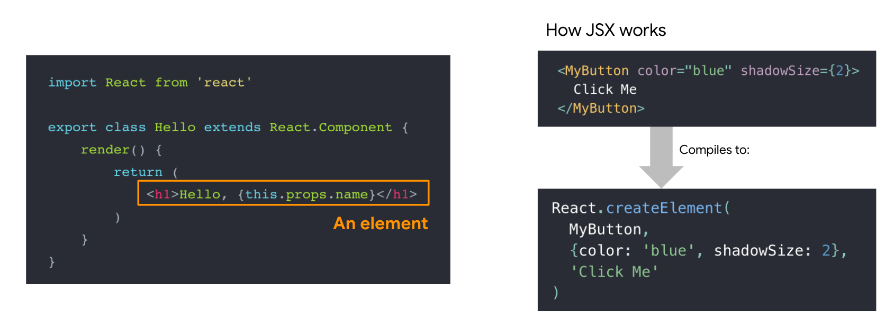
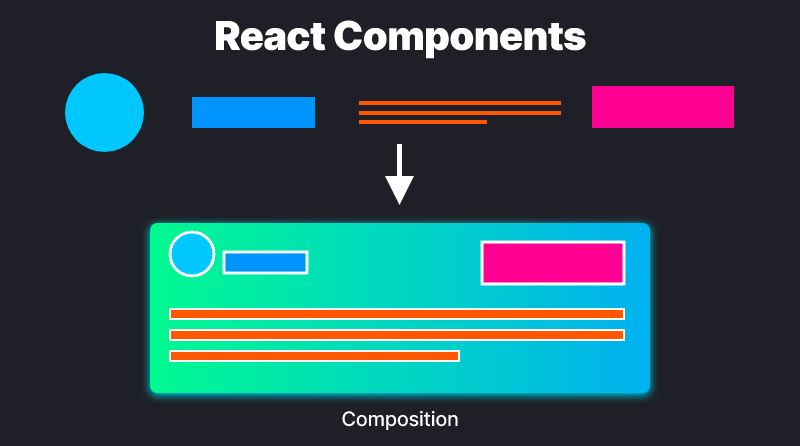
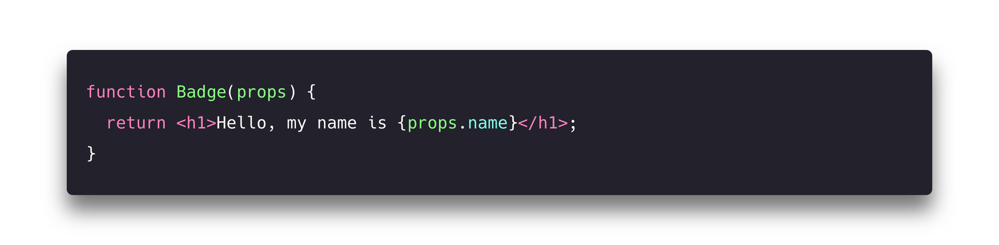

# **Overview of React.js**

> 재사용 가능한 사용자 인터페이스 구성 요소를 빌드하기 위한 UI 라이브러리

여러 해 동안 JavaScript를 사용하여 사용자 인터페이스를 **구성하는** 직접적인 방법?에 대한 수요가 증가했습니다. React.js라고도 하는 [**React**](https://reactjs.org/)는 사용자 인터페이스 또는 UI components를 구축하는데 사용되는 Facebook에서 디자인한 오픈 소스 JavaScript 라이브러리입니다.

물론 React가 유일한 UI 라이브러리는 아닙니다. [Preact](https://preactjs.com/?lang=kr), [Vue](https://kr.vuejs.org/v2/guide/index.html), [Angular](https://angular.kr/), [Svelte](https://svelte.dev/), [Lit](https://lit.dev/) 및 많은 다른 라이브러리도 재사용 가능한 요소에서 인터페이스를 구성하는 데 훌륭합니다. React의 인기를 생각하면, 이 가이드에서 디자인, 렌더링 및 성능 패턴 중 일부를 살펴보기 위해 React 작동하는 방법을 살펴보는 것은 가치가 있습니다.

프론트엔드 개발자 코드에 관해 이야기할 때, 웹용 인터페이스를 디자인하는 주제에 대해 가장 자주 이야기합니다. 그리고 우리가 인터페이스 구성에 대해 생각하는 것은 button, list, navigation 등과 같은 요소가 있습니다. React는 이러한 요소에서 인터페이스를 표현하는 최적화되고 단순화된 방법을 제공합니다. 또한 인터페이스를 세 가지 주요 개념(components, props, state)으로 구성하여 복잡하고 까다로운 인터페이스를 구축하는 데 도움이 됩니다.

React는 구성에 집중하기 때문에 디자인 시스템의 요소에 완벽하게 매핑할 수 있습니다. 따라서 본질적으로 React를 위한 디자인은 실제로 모듈 방식으로 생각하는 것에 대한 보상입니다. 이것은 페이지나 뷰를 합치기 전에 각 components를 설계할 수 있기 때문에, 각 components의 범위와 목적(컴포넌트화라고 하는 프로세스)을 완전히 이해할 수 있습니다.

우리가 사용할 용어:

- **React/React.js/ReactJS** - 페이스북이 2013년에 만든 React 라이브러리
- **ReactDOM** - DOM과 서버 렌더링을 위한 패키지
- **JSX** - JavaScript에 대한 문법 확장
- **Redux** - 중앙 집중식 상태 관리
- **Hooks** - class를 사용하지 않고 state와 기타 React 기능을 사용하는 새로운 방법
- **React Native** - JavaScript로 크로스 플랫폼 네이티브 앱을 개발하기 위한 라이브러리
- **Webpack** - React 커뮤니티에서 인기있는 JavaScript 모듈 번들러
- **CRA (Create React App)** - 프로젝트 검증?을 위해 스케폴딩 React 앱을 만드는 CLI 툴
- **Next.js** - SSR, 코드 분할, 성능 최적화 등을 포함한 동급 최고의 기능을 갖춘 React 프레임워크

## Rendering with JSX

우리는 많은 예제에서 JSX를 사용할 것입니다. JSX는 XML과 유사한 구문을 사용하여 JS에 템플릿 HTML을 포함하는 JavaScript의 확장입니다. 이러한 변환의 의미는 구현에 따라 다르지만 유효한 JavaScript로 변환하기 위한 것입니다. JSX는 React 라이브러리와 함께 인기를 얻었지만, 그 이후로 다른 구현도 볼 수 있게 되었습니다.

## Components, Props, and State

components, props, state는 React의 세 가지 핵심 개념입니다. React에서 보거나 수행하게 될 거의 모든 것은 이러한 핵심 개념들 중 하나 이상으로 분류할 수 있습니다. 그리고 이러한 핵심 개념에 대한 설명입니다.

### Components

Components는 모든 React App의 기본 요소입니다. 이것은 임의의 input(props)을 받아드리고 화면에 표시되어야 하는 내용을 설명하는 React 요소를 반환하는 JavaScript 함수와 같습니다. 가장 먼저 이해해야 하는 것은 React App의 화면에 있는 모든 것이 components의 일부라는 것입니다. 기본적으로 React App은 components 내 components 내의 components일 뿐입니다. 따라서 개발자는 React에서 페이지를 빌드하지 않습니다. 단지 components를 빌드합니다.

Components를 사용하면 UI를 독립적이고 재사용 가능한 부분으로 나눌 수 있습니다. 만약 페이지 디자인에 익숙하다면, 이 모듈식 방식으로 생각하는 것이 큰 변화처럼 보일 수 있습니다. 하지만 디자인 시스템이나 스타일 가이드를 사용한다면? 그렇다면 이것은 보이는 것처럼 큰 패러다임 전환이 아닐 수도 있습니다.

Components을 정의하는 가장 직접적인 방법은 JavaScript 함수를 작성하는 것입니다.

